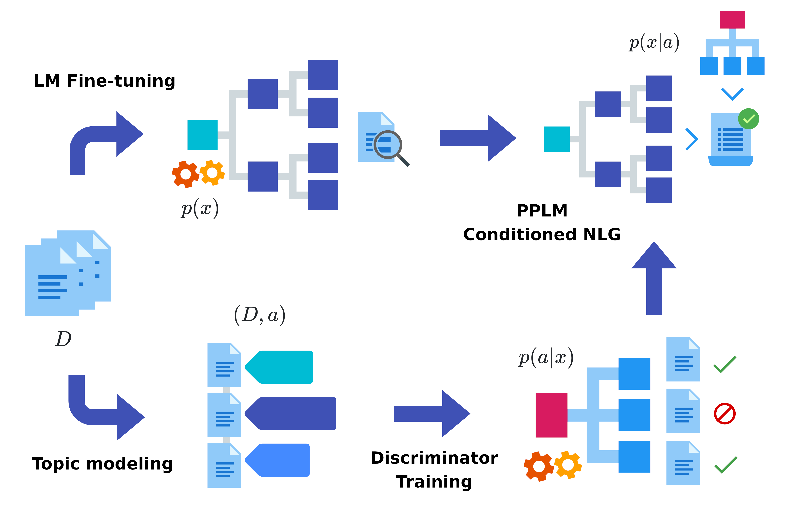

# ETC-NLG: End-to-end Topic-Conditioned Natural Language Generation


>Figure: A visual representation of the End-to-end Topic-Conditioned Natural Language Generation (ETC-NLG) pipeline. An unlabeled document collection is used to train a language model (top) and a topic model (bottom). Automatic topic annotations are used to condition the generation of a plug-and-play language model through a discriminator network.

This repository contains the code to reproduce the experiments of our paper [ETC-NLG: End-to-end Topic-Conditioned Natural Language Generation](arxiv.org/abs/2008.10875), accepted at the 4th Workshop on Natural Language for Artificial Intelligence (NL4AI).

## Setup

The `data` folder contains the original Svevo corpus without topic annotations. Please contact us at [gabriele.sarti996@gmail.com](mailto:gabriele.sarti996@gmail.com) if you wish to have access to the unreleased gold version with gold annotations.

The Europarl it-en corpus can be downloaded [here](http://www.statmt.org/europarl/).

In order to run the scripts for topic modeling and conditional language generation, we suggest creating a virtual environment and installing our working setup with `pip install -r requirements.txt`. 

Note that you may need to downgrade your `torch` installation depending on your version of CUDA and your GPU: topic modeling experiments were carried out using `torch 1.3.0` on a NVidia Tesla K40 with CUDA 10.1, and conditional generation was done using `torch 1.5.1`. This shouldn't affect the final performances of the system.

## Topic Modeling and Conditional Language Generation

Please refer to [scripts/README.md](scripts/README.md) for examples of running the scripts to train contextualized/combined topic models and plug-and-play language models.

If you would like some clarifications on how to run the scripts, please raise an issue here on Github.

## Citation

If you use ETC-NLG in your work, please cite us as:

```bibtex
@inproceedings{,
  author = {Carbone, Ginevra and Sarti, Gabriele},
  editor = {Basile, Pierpaolo and Basile, Valerio and Croce, Danilo and Cabrio, Elena},
  title = {{ETC-NLG}: End-to-end Topic-Conditioned Natural Language Generation},
  date  = {2020},
  address = {Online}
  publisher = {CEUR.org}
  booktitle = {Proceedings of the 4th Workshop on Natural Language for Artificial Intelligence (NL4AI)}
  url = {https://arxiv.org/abs/2008.10875},
}
```
